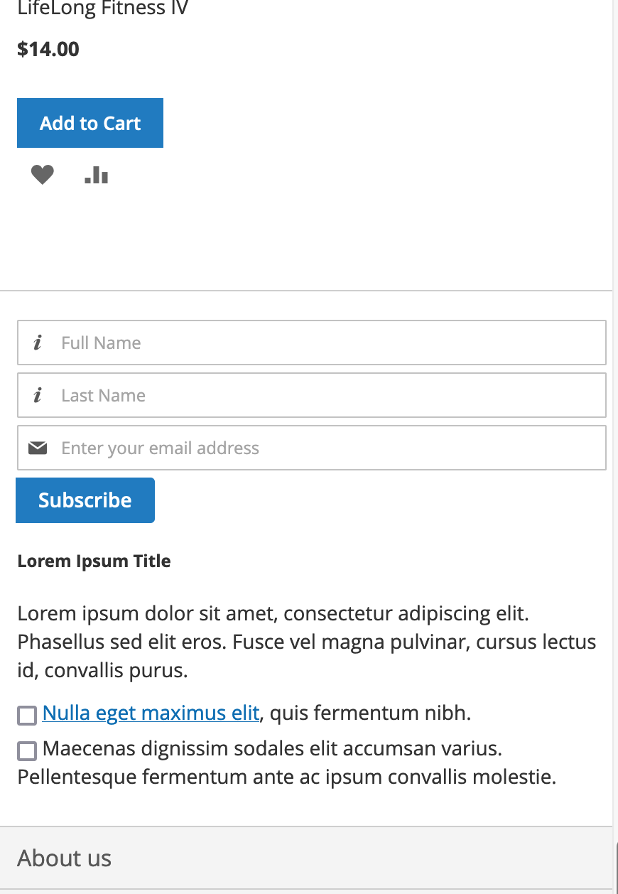

# Newsletter Subscriber Info

The module allows those who want to subscribe to the newsletter to save their "name" and "surname" information.

 

 
 
 
 
 **For Video**
 
 
 
# Installation

- Create "***Coskun***" folder under "***App/Code***" and add the module into it.
- Run "`bin/php magento setup:upgrade`".
- Run "`bin/php magento cache:clean`".
- After the module is installed, the module should be activated from the settings that will come under "***Stores/Configuration***" in the admin panel and the settings should be completed.

# Settings

Module settings can be made under the "***Coskun Settings***" menu under "***Store/Configuration***".

 
 
## "General Configuration"

| # | Description | Default Value |
|--|--|--|
| **Module Enable** | The module can be turned on or off from the admin panel. | Yes |
| **Firstname Field Enable** | You may hide or show "Firstname" field  | Yes |
| **Firstname Field Placeholder** | You may change "Firstname" field label | First Name |
| **Lastname Field Enable** | You may hide or show "Lastname" field  | Yes |
| **Lastname Field Placeholder** | You may change "Lastname" field label | Last Name |
| **E-mail Field Placeholder** | You may change "Email Address" field  | Enter your email address |
| **Submit Button Label** | You may change submit button label | Subscribe |
| **Newsletter Terms And Conditions** | You may add description and terms&conditions for newsletter form. HTML tags writable. You can see the options and explanations below.  | - |
|  |  **Text** : Label which shows up on the frontend text  | - |
|  | **Type** : It's a type of the text. It takes one of "info" or "checkbox".    | - |
|  |  **Is Required** : This options only for "checkbox" types. You may required option the checkbox and users do not continue without clicking the option.  | - |
 
# Licence

It is free software distributed under the terms of the MIT license.
